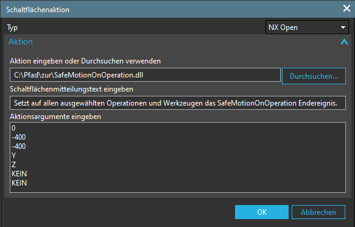

# Werkzeugdatenbank
## **Erstellt parametrische Werkzeuge aus der Werkzeugdatenbank.**

**Optional kann bei jedem Werkzeug ein Halter angegeben werden, welcher mit dem passenden Offset erstellt wird.**

### Unterstützte Werkzeuge:

- **Schaftfräser**
- **Schaftfräser mit Eckenverrundung**
- **Kugelfräser**
- **Fasenfräser**
- **Spiralbohrer**
- **Wendeplattenbohrer (180°)**
- **Gewindebohrer**
- **Reibahle**

---

In ***NX*** einen neuen ***Anwenderbefehl*** hinzufügen und unter ***Aktionsargumente*** folgende Parameter eingeben:

-***Pfad zur Werkzeugdatenbank***

-***Tabellenname der jeweiligen Maschine der Datenbank***

-***Name der Werkzeugaufnahme in der Wkz-Maschinenansicht***

-***Pfad zur Halterliste***

    X:\Pfad\zur\Werkzeugdatenbank.db
    FP4A
    GENERIC_MACHINE
    X:\Pfad\zur\Halterliste.txt

## **Hinweise**

**Alle** Bohrertypen ignorieren die Schneidenanzahl und werden immer mit einer Schneide erstellt.

Schneidenlänge wird bei Fräsertypen und Gewindebohrer auf ***2,5xD*** und bei allen anderen Bohrertypen auf ***7xD*** festgelegt.

Gewindebohrer versucht die zum Durchmesser passende Steigung zu finden, wird auf 1 gesetzt falls keine gefunden wurde.

Gewindebohrer wird ohne Anschnittdurchmesser & Länge erstellt.

Falls ein Werkzeug mit gleichen Namen bereits existiert wird dieses aktualisiert (Schneidenlänge wird beibehalten).

---

# SafeMotionOnOperation
Setzt auf allen ausgewählte Operationen & Werkzeugen das ***SafeMotionOnOperation*** Endereignis.
-
Folgende Argumente können mit Standardwerten belegt werden:
    
    X-Freifahrposition  ->  0..-1000
    Y-Freifahrposition  ->  0..-1000
    Z-Freifahrposition  ->  0..-1000
    1ter Verfahrweg     ->  KEIN, XYZ, XY, YZ, ZX, X, Y, Z
    2ter Verfahrweg     ->  KEIN, XY, YZ, ZX, X, Y, Z
    3ter Verfahrweg     ->  KEIN, X, Y, Z
    Drehachsen          ->  KEIN, Beide, B, C

---
Beispiel:

---

# Templatevoreinstellung
## Aktiviert für alle Objekte in jeder Navigatoransicht:
- **Programmreihenfolgeansicht**
- **Wkz-Maschinenansicht**
- **Geometrieansicht**
- **Bearbeitungsmethodenansicht**

### die Templatevoreinstellungen:
- *Objekt kann als Vorlage verwendet werden*
- *Mit übergeordnetem Teil erzeugen*

---
In die Aktionsargumente des NX-Anwenderbefehl den Name des Wurzelelement der *Wkz-Maschinenansicht* eintragen.

### Hinweis
Wird kein Name angegeben wird automatisch der Standardname **GENERIC_MACHINE** verwendet.

---

# Werkzeugnummern
Nummeriert alle Werkzeuge fortlaufend ab 1 durch.

---

# Werkstücke erstellen
Erstellt die übergebene Anzahl an Werkstücken innerhalb einer Geometrie.

---

# Referenzkopie
Kopiert das MCS_G54 Objekt in jedes gefundene Objekt welche dem MCS_MAIN untergeordnet sind mit Referenz.

---

# MCS nummerieren
Ersetzt den Name des ersten gefundenen MCS und dem darunterliegenden CYCLE800-MCS unter jedem Workpiece im MCS_MAIN durch MCS_G54...MCS_G599 und die Nullpunkt-Verschiebung im MCS Objekt fortlaufend ab 1.

---

# Maschine anzeigen
Zeigt die Maschine mit ausgeblendeter Frontverkleidung an.

---

# Hinweise
Erstellt einen Hinweis auf allen ausgewählten Operationen.
